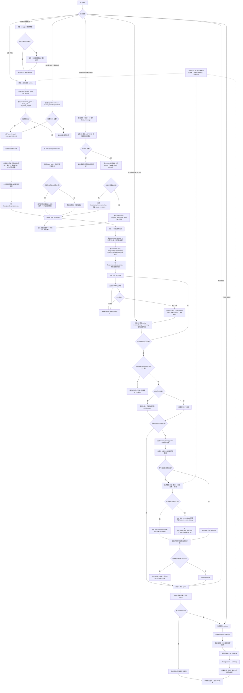
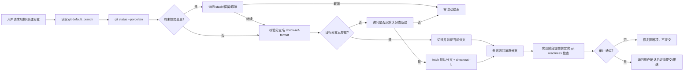

# svn-impact 执行流程图

本文件是 `svn-impact` 的可视化流程基线。它与 `SKILL.md` 保持同一条执行契约：后续优化 SKILL 时，先更新流程图和节点说明，再同步修改文字规则与 Evals。单笔和批次都遵循同一条 A → A+ → A++ → B/前置数据 → C → 报告分析生命周期；批次只在阶段 A 增加 resolver、逐笔 worker 和 aggregate design。公共规则见 `references/common-analysis-contract.md`，功能用例设计仍统一引用 `references/functional-case-design.md`。

## 总流程



## 节点说明

| 节点 | 关键规则 | 失败处理 |
|------|----------|----------|
| 阶段 A | 单笔取一个正整数 revision；批次先由 resolver 解析实际 revision 集合，再逐笔调用同一个 worker。第一步 `e9_svn_log` + `e9_svn_diff`，结构查询走 `search_graph` + `trace_path`；不执行本地 SVN，不用 `detect_changes` / `impact` / `callers` | MCP 失败写警告，不编造事实；批次按 revision 重试，最终缺事实则阻断 B |
| 批次聚合 | 逐笔 facts/design/reverse_lookup 完成后再合并文件、符号、端点、影响模块和用例候选，保留 `source_revisions`；聚合后仍进入同一 A+ / A++ / B / C | resolver 不完整或任一关键事实缺失时只生成审计报告，`stage_b_gate=false` |
| 契约审视 | 纯前端但改变了接口消费方式时，定位接口、实核准契约、补只读契约用例；详见 `references/pure-frontend-contract.md` | 看不到返回结构不编造；URL 已有封装则复用 |
| 阶段 A+ 功能用例设计 | 单笔和批次统一按 `references/functional-case-design.md` 设计；批次先合并联合影响面，再覆盖所有受影响模块；前置数据先查询并复用，确认缺失后**能自动造则自动造、能拆多步则拆多步**；产出 `functional_test_cases.md`；不落自动化代码 | 缺事实/接口证据时不编造，标注「图谱未覆盖」 |
| 阶段 A++ 人工审核 | 呈现清单 → 反馈 → 就地修改 → 再确认，循环至人工定稿；未经定稿不进入阶段 B | 中途换 revision/回阶段 A 按触发词重入，不强行推进 |
| 阶段 B | URL 已封装则复用；从定稿功能用例抽「非 manual」条目落接口用例并标注来源 FC 编号；新增用例前读取后端与前端证据 | 无证据不得凭猜测生成接口或断言；端点需人工复核时阻塞 |
| 后端反查 | `search_graph` + `trace_path(inbound)` 查询变更符号、入口和调用方；端点为空必须输出诊断 | 记录候选入口和人工复核，不静默判空 |
| 前端反查 | 扫描页面、菜单、按钮、表单、事件处理器、请求封装和 URL；必要时用浏览器 Network/Har 运行证据校正静态结果 | 动态拼接无法解析时标记 `needs_runtime_trace` |
| 阶段 B | URL 已封装则复用；新增用例前读取后端与前端证据（reverse_lookup.json） | 无证据不得凭猜测生成接口或断言；端点需人工复核时阻塞 |
| 前置数据 | 先用业务接口查询并复用当前环境数据；确认缺失后生成计划、幂等构建、状态文件和 cleanup；经 test_data_runner 过敏感门禁，输出只含业务标识 | 造数失败按四项格式阻塞；代码完成但运行时仍缺数据时才安全跳过，不索要内部 ID |
| 阶段 C | 环境 revision 未确认时使用结构化成功断言，行为差异写 Allure 信息附件 | 不把环境版本差异定性为产品缺陷 |
| 报告分析 | 先冻结 manifest，再分片分析，主会话唯一回写 | SHA 变化或出现敏感信息时停止回写 |
| Allure 报告查看 | 交付前起本地 HTTP 服务（`python -m http.server 8917`），以 http 链接打开，禁 file:// | Git Bash 下 allure fork 失败改用 PowerShell 调 allure.bat；端口占用换空闲端口 |
| Git/文件安全 | 分支操作保护既有引用；清理只作用于可再生产物 | 失败回滚原状态并保留用户变更 |

## 分支与交付流程

Git 分支操作由同级 `git-branch` SKILL 负责；`svn-impact` 只在实现和交付边界调用它，不直接静默切换或删除分支。



交付清单只暂存本次 `page_api/`、`test_case/`、`tools/`、`test_data/`、`.workbuddy/`、`E9_svn_analyse/` 和必要文档；不使用宽泛 `git add .`。远端开发 R1-R5 不得在本地四期未验收时启动。

## 前端操作证据格式

前端反查结果写入 `facts.json` 的 `frontend_operations`（四期起由 `analyse` 自动产出），每条至少包含：

```json
{
  "operation": "文档下载",
  "page": "相对页面路径或路由",
  "trigger": "按钮/菜单/表单提交及事件函数",
  "request": {"method": "POST", "url": "/api/..."},
  "parameters": ["字段名"],
  "response_effect": "页面状态或下载结果",
  "evidence": {"source": "static_scan", "file": "相对文件", "line": 12, "matched": "命中片段"},
  "confidence": "static|runtime|confirmed|conflict"
}
```

`confidence` 只能取 `static`、`runtime`、`confirmed`、`conflict` 四个值。静态扫描未命中的端点不伪造证据，记入 `reverse_lookup.json` 的 `frontend_scan.misses`，标注需浏览器 Network/HAR 运行时证据。当静态 URL 与运行时 Network 记录不一致时，保留两份证据并标记 `conflict`，不能自动选择一个"看起来正确"的地址。
