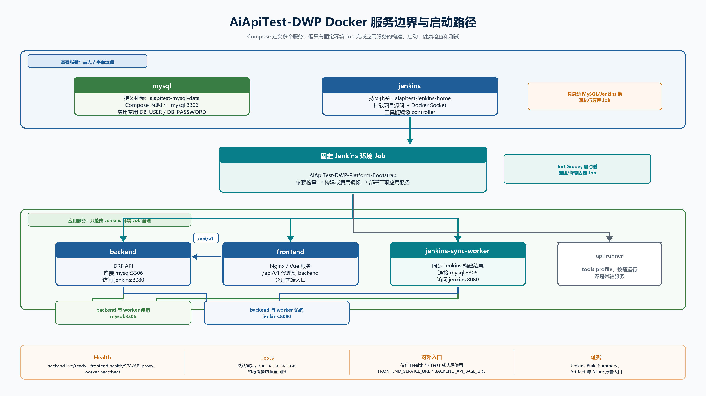

# Docker Deployment



本文档说明当前 AiApiTest-DWP 的 Docker 构建方式、服务边界和供主人/平台运维使用的启动流程。它回答一个容易混淆的问题：Compose 确实声明了多个服务，但**不能以直接拉起全部 Compose 服务替代平台环境构建**。完整可用状态必须由固定 Jenkins 环境 Job 验证。

> **仅主人/平台运维执行，AI 不得执行。** 本文中的 Docker bootstrap 命令只用于基础服务；环境 Job/helper 永不管理 MySQL 与 Jenkins。

## 先看结论

平台分为两个生命周期边界：

| 边界 | 服务 | 谁启动和维护 | 目的 |
| --- | --- | --- | --- |
| 基础服务 | `mysql`、`jenkins` | 主人或平台运维 | 为平台提供数据库与构建控制器；数据卷独立持久化。 |
| 应用服务 | `backend`、`frontend`、`jenkins-sync-worker` | `AiApiTest-DWP-Platform-Bootstrap` | 统一执行依赖检查、镜像构建、部署、健康检查和测试。 |
| 按需工具镜像 | `api-runner` | Jenkins 测试流水线 | 仅 `tools` profile 使用，不是第六个常驻服务。 |

因此，正确的首次使用路径是：

1. 主人或平台运维启动 `mysql` 与 `jenkins`。
2. Jenkins 启动时运行版本化 Init Groovy，幂等创建或修复 `AiApiTest-DWP-Platform-Bootstrap`。
3. 在 Jenkins 页面构建该 Job，或使用仓库 helper 触发同一 Job。
4. Job 成功完成后，才通过 `.env` 配置的前端、后端公开地址使用平台。

直接运行 `docker compose up -d` 可能让多个容器显示为运行中，但会绕过依赖完整性、镜像输入哈希、健康检查、冒烟或全量测试以及 Jenkins 证据归档，不能作为当前平台“已可用”的判断依据。

## 构建与服务实现

`docker-compose.yml` 的 Compose project 为 `aiapitest-dwp`，所有服务使用 `aiapitest-platform` 网络。默认 Compose 服务如下；默认 Jenkins controller 构建 `docker/jenkins/Dockerfile` 工具链镜像 `aiapitest-jenkins:lts-jdk17-tools`，不是可选 override。

| 服务或镜像 | 实现方式 | 关键连接 | 对外入口 |
| --- | --- | --- | --- |
| `mysql` | MySQL 8.4，持久化卷 `aiapitest-mysql-data` | Compose 内为 `mysql:3306` | 由 `MYSQL_BIND_HOST`、`MYSQL_HOST_PORT` 决定。 |
| `jenkins` | 由 `docker/jenkins/Dockerfile` 构建工具链镜像 | 挂载 Docker Socket、项目源码和 Init Groovy | `JENKINS_PUBLIC_BASE_URL`。 |
| `backend` | `back-end/Dockerfile` 构建，Gunicorn 提供 DRF | 使用应用专用 `DB_USER` / `DB_PASSWORD` 访问 `mysql:3306` | `BACKEND_SERVICE_URL`、`BACKEND_API_BASE_URL`。 |
| `frontend` | `front-end/Dockerfile` 构建，Nginx 运行时镜像 | 通过 API 代理访问 backend | `FRONTEND_SERVICE_URL`。 |
| `jenkins-sync-worker` | 复用 backend 镜像，执行 `sync_jenkins_results --watch` | 访问 `mysql:3306` 和 `jenkins:8080` | 无宿主机端口；以心跳 healthcheck 验证。 |
| `api-runner` | `api-test/Dockerfile` 构建 | 仅 Jenkins 以隔离容器方式运行 | 无常驻容器、无公开端口。 |

`api-runner` 使用 `tools profile`，只在 Jenkins 调度接口自动化或环境全量测试时按需运行；它不应由主人或 AI 当作常驻服务启动。

关键 Docker 文件：

| 文件 | 用途 |
| --- | --- |
| `docker-compose.yml` | 默认 Compose 服务、网络、volume 与 Jenkins 工具链镜像构建定义。 |
| `docker/jenkins/Dockerfile` | 默认 Jenkins tools 镜像构建来源。 |
| `back-end/Dockerfile` | backend 与 Jenkins 同步 worker 镜像构建来源。 |
| `front-end/Dockerfile` | frontend 运行与测试镜像构建来源。 |
| `api-test/Dockerfile` | api-runner 隔离测试镜像构建来源。 |

Jenkins controller 使用 Docker Socket 控制**应用服务**镜像和容器。环境 Job 在部署前记录 MySQL/Jenkins 容器 ID，部署后再次核对；基础服务在构建期间发生改变时会失败并保留诊断。因此环境 Job 从不启动、停止或重建 MySQL/Jenkins。

## 首次启动

### 1. 准备私有 `.env`

根目录 `.env` 是本地私有配置入口，不能提交 Git。**首次启动前先手工从 `.env.example` 创建并补齐 `.env`，再运行 bootstrap helper。** helper 在发现 `.env` 缺失时会自动复制模板，但不会暂停等待填写私有项，而是继续执行 `docker compose up`；不能把该自动复制路径当作首次配置步骤。

必须在本地 `.env` 维护的私有项包括：

- `MYSQL_ROOT_PASSWORD`、`DB_USER`、`DB_PASSWORD`
- `DJANGO_SECRET_KEY`、`AUTH_TOKEN_SECRET`
- 初始化管理员信息
- Jenkins 的用户名与 API Token（本地 Init Groovy 可由 bootstrap helper 写入私有 `.env`）

`DB_USER` 与 `DB_PASSWORD` 是 Compose **必填**的应用专用非 root 数据库用户和密码，**只写入本地 `.env`**。`MYSQL_ROOT_PASSWORD` 只用于 MySQL 管理和初始化，不作为 backend 或 worker 的应用连接账号。

可提交的 `.env.example` 仅定义通用网络、端口和地址模板。常用公开配置包括：

| 配置类别 | 代表变量 | 用途 |
| --- | --- | --- |
| Jenkins | `JENKINS_PUBLIC_BASE_URL`、`JENKINS_HTTP_PORT`、`JENKINS_PLATFORM_BOOTSTRAP_JOB_NAME` | Jenkins 页面入口和固定 Job 名。 |
| 挂载与 Socket | `PROJECT_WORKSPACE`、`AIAPITEST_LOCAL_WORKSPACE`、`DOCKER_GID` | 让 Jenkins 使用当前仓库并访问 Docker Socket。 |
| 应用地址 | `BACKEND_SERVICE_URL`、`BACKEND_API_BASE_URL`、`FRONTEND_SERVICE_URL` | 供 Summary、验收和使用者访问。 |
| 前端测试 | `FRONTEND_PLAYWRIGHT_BASE_IMAGE`、`PLAYWRIGHT_BASE_URL` | 构建和 Playwright 环境。 |

`PROJECT_WORKSPACE` 必须指向当前正在开发或验收的仓库根目录。它指向旧工作区时，Jenkins 会加载旧代码，即使当前分支已提交也不会生效。

### 2. 启动基础服务

Windows PowerShell：

```powershell
.\scripts\deploy-docker.ps1
```

Linux、macOS 或 Git Bash：

```bash
bash scripts/deploy-docker.sh
```

上述脚本会校验 Docker Compose、启动 `mysql` 与 `jenkins`，并等待本地 Jenkins Init Groovy 生成运行时 API 凭据。它们不启动 backend、frontend 或 worker。若 `.env` 意外缺失，脚本会复制模板后立即继续执行，因此应停止该次启动、补齐私有项后重新运行脚本。

如需只执行基础服务 Compose 命令，主人或平台运维可执行：

```bash
docker compose up -d mysql jenkins
docker compose ps
```

等待 MySQL 为 `healthy`、Jenkins 页面可访问后，Jenkins 启动时幂等创建或修复固定 Pipeline Job。默认 Job 名由私有 `.env` 的 `JENKINS_PLATFORM_BOOTSTRAP_JOB_NAME` 管理，默认值为 `AiApiTest-DWP-Platform-Bootstrap`。

### 3. 构建平台应用环境

在 Jenkins 页面打开固定 Job 后点击 Build，默认参数即为全量应用重建和冒烟验收：

| 参数 | 默认值 | 行为 |
| --- | --- | --- |
| `build_all` | `true` | 重新构建三项应用镜像，并以 `--force-recreate` 重建 backend、frontend、worker。 |
| `run_full_tests` | `false` | 仅执行不依赖登录账号的健康与冒烟测试。 |

需要增量重建和全量回归时，将 `build_all=false`、`run_full_tests=true`。增量模式只复用镜像标签和完整性均满足的依赖域；服务缺失或构建输入发生变化时仍会重建。

也可以用 helper 触发同一 Jenkins Job，而不是在宿主机直接启动应用服务：

Windows PowerShell：

```powershell
# 默认：全量重建 + 冒烟
.\scripts\trigger-platform-bootstrap.ps1

# 增量检查 + 全量回归
.\scripts\trigger-platform-bootstrap.ps1 -BuildAll false -RunFullTests true
```

Linux、macOS 或 Git Bash：

```bash
# 默认：全量重建 + 冒烟
bash scripts/trigger-platform-bootstrap.sh

# 增量检查 + 全量回归
bash scripts/trigger-platform-bootstrap.sh --build-all false --run-full-tests true
```

helper 只通过 Jenkins API 提交并轮询固定 Job，使用相同的参数、阶段、日志和结果契约，不是本机启动旁路。

## 环境 Job 的七个阶段

| 阶段 | 做什么 | 失败后的处理 |
| --- | --- | --- |
| Checkout/Workspace | 使用当前挂载仓库或受管 SCM 获取流水线源码。 | 保留 Jenkins 控制台和可用证据。 |
| Bootstrap Preflight | 校验 `.env`、Docker CLI/Compose、Socket/GID、MySQL/Jenkins 运行状态以及 MySQL health。 | 输出结构化诊断并停止。 |
| Dependency Assurance | 分别校验 backend、frontend、api-runner 三个依赖域。缺失或不满足时各只安装/构建一次，完整记录日志。 | 汇总失败域，在部署前停止。 |
| Deploy | 仅部署 backend、frontend、`jenkins-sync-worker`。 | 保留服务与部署日志；不回滚、不删除卷。 |
| Health | 探测 backend live/ready、frontend health/SPA/API 代理和 worker 心跳。 | 输出失败服务的结构化原因与证据。 |
| Tests | 默认执行公开健康与冒烟探针；全量模式还运行 backend pytest、frontend unit/build/Playwright、api-runner/Jenkins 静态测试。 | 归档已有测试证据并标记构建失败。 |
| Archive & Summary | 归档证据并发布可用的 Allure 结果。 | 即使前序失败也尽力生成 Summary 与归档。 |

环境 Job 不执行 Django migration、初始化管理员、`collectstatic`、自动 rollback、`down -v` 或 volume 删除。服务或依赖失败时，先阅读 Jenkins 的 Summary、结构化诊断和 Artifact，修复根因后重新构建。

## 访问平台与构建产物

环境 Job 成功后，从其 Summary 读取由 `.env` 注入的公开地址：

- Jenkins：`JENKINS_PUBLIC_BASE_URL`
- 前端：`FRONTEND_SERVICE_URL`
- 后端与 API 文档：`BACKEND_SERVICE_URL`、`BACKEND_API_BASE_URL`
- 测试证据和 Allure：当前 Jenkins Build 的 Artifact 与 Allure 入口

Allure 是 Jenkins Build 级插件和归档入口，不是额外常驻 Compose 服务。原始运行日志、报告、截图和测试证据只保留为 Jenkins Artifact，或在 `docs/` 临时目录短暂存放后清理，不提交 Git。

## 故障排查

| Jenkins 诊断或现象 | 处理方式 |
| --- | --- |
| `.env` 缺失、变量或公开地址错误 | 修正本地私有 `.env`，不要提交；重新构建固定 Job。 |
| Docker CLI、Compose、Socket 或 `DOCKER_GID` 不可用 | 修复 Jenkins 工具链镜像、Socket 挂载或 GID，然后由主人/平台运维重建 Jenkins bootstrap。 |
| MySQL 未运行或 `unhealthy` | 由主人/平台运维启动或修复 MySQL，等待 `healthy` 后重新构建。 |
| backend、frontend 或 api-runner 依赖构建失败 | 阅读对应依赖域完整安装日志，修复 Dockerfile、lockfile、镜像源或网络后重新构建；每次构建内不会重复安装。 |
| Health 超时 | 阅读 Job Health 阶段和相应服务日志，修复配置或应用逻辑后重新构建。 |
| helper 认证、Job 名或轮询超时 | 校验 Jenkins 私有凭据、`JENKINS_PLATFORM_BOOTSTRAP_JOB_NAME` 与 timeout 配置，修复后再次触发 helper。 |
| Jenkins 加载旧代码 | 修正 `PROJECT_WORKSPACE`，保持它指向当前仓库；重建 Jenkins bootstrap 后再运行 Job。 |

### MySQL 密码不一致：

1. 确认私有 `.env` 中的 `MYSQL_ROOT_PASSWORD` 仅用于 MySQL 管理和初始化，同时已配置必填的 `DB_USER` 与 `DB_PASSWORD`。
2. backend 与 `jenkins-sync-worker` 的应用连接只使用 `DB_USER`、`DB_PASSWORD`；确认 MySQL 中存在匹配的应用专用非 root 数据库用户和密码。
3. 持久化数据卷已初始化后，修改 `.env` 不会自动更新 root 或应用用户密码。需要变更时由主人/平台运维在确认数据策略后同步凭据；环境 Job 不会删除数据卷。

## 环境 Job 创建与使用

固定 Job 由 Jenkins 启动时幂等创建或修复，不能在 Jenkins Script Console 手工创建旁路 Job。主人在 Jenkins 页面构建同一个 `AiApiTest-DWP-Platform-Bootstrap`，或使用 `scripts/trigger-platform-bootstrap.ps1`、`scripts/trigger-platform-bootstrap.sh` 触发同一契约。失败时先阅读 Jenkins 结构化诊断，修复后重新构建。

## 维护与安全边界

基础服务维护命令只供主人或平台运维使用：

```bash
docker compose ps
docker compose logs -f mysql
docker compose logs -f jenkins
docker compose down
```

`docker compose down` 会停止基础服务但保留命名数据卷。删除卷、`down -v`、`chmod 666 /var/run/docker.sock` 均不属于正常平台操作；执行数据清理前必须确认本地 Jenkins/MySQL 数据不再需要。

Docker Socket 使 Jenkins controller 具备主机级 Docker 控制能力，只适用于受信任的本地开发或验收 controller，不能用于不受信任的 SCM/PR Job。这不是生产部署安全承诺。Linux 应由主人/平台运维读取 Socket 实际组 ID 并写入私有 `.env` 的 `DOCKER_GID`；Windows Docker Desktop 使用的值也必须以实际环境验证。任何环境都禁止 `chmod 666 /var/run/docker.sock`。

AI 对 backend、frontend、worker 的重启、依赖检查/安装和环境验收必须且只能触发 `AiApiTest-DWP-Platform-Bootstrap`，或使用两个 helper 触发同一 Job。AI 不得直接执行应用服务 `docker compose up/restart/stop/down`、`docker build`、`pip install`、`npm install/npm ci`、Django `runserver`、Vite 或 worker 启动命令。

## 修改配置后的刷新

修改本地挂载路径、固定 Job 名或 Jenkins Init Groovy 后，主人/平台运维可保留 Jenkins 数据卷并重建 Jenkins 容器，使 Init Groovy 再次执行：

```bash
docker compose up -d --no-deps --force-recreate jenkins
```

之后确认固定 Job 已由启动初始化脚本创建或修复，再从 Jenkins 页面重新构建环境 Job。应用源代码、Dockerfile、前端或 api-test 依赖变化，不在 Jenkins controller、宿主机或运行容器内动态安装；使用 `build_all=true` 的环境 Job 统一重建。
