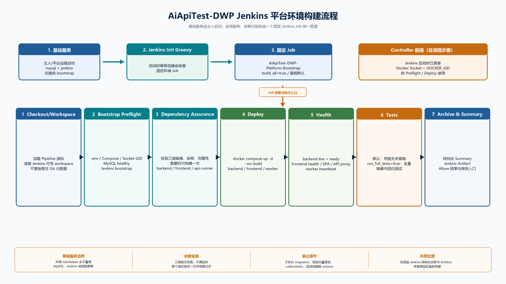

# Jenkins 构建与平台环境说明



`jenkins/` 保存 AiApiTest-DWP 的 Pipeline、Groovy 初始化脚本和可测试的编排辅助程序。Jenkins 是平台测试执行、报告归档和平台应用环境准备的唯一编排主干。

## 使用结论

`docker-compose.yml` 定义了 MySQL、Jenkins、backend、frontend、jenkins-sync-worker 五个常驻服务，以及按需使用的 `api-runner` 工具镜像。直接启动全部 Compose 服务在技术上可能拉起已有镜像对应的容器，但它会绕开依赖校验、镜像输入校验、健康检查、测试和证据归档，不能作为本平台的标准使用方式，也不能保证当前平台已准备完成。

标准路径分为两层：

1. 主人或平台运维先按 [Docker 部署说明](../docker/DEPLOYMENT.md) 启动 `mysql` 和 `jenkins` 两个 bootstrap 基础服务。
2. Jenkins 启动后，版本化 init Groovy 会幂等创建或修复 `AiApiTest-DWP-Platform-Bootstrap`。随后在 Jenkins 页面构建该 Job，或通过 helper 触发同一 Job；由该 Job 管理 `backend`、`frontend` 和 `jenkins-sync-worker` 的环境准备与启动。

`api-runner` 是 `tools` profile 下的隔离测试镜像，不是常驻应用服务。业务测试 Pipeline 在需要时创建 runner 执行测试并归档结果。

## 平台环境 Job

### 创建方式与固定契约

Compose Jenkins 会把 `jenkins/scripts/configure-local-mounted-jobs.groovy` 以只读方式挂载到 `init.groovy.d`。挂载源码目录有效时，Jenkins 启动会幂等创建或修复固定环境 Job，不需要也不应手工创建同名或旁路 Job。

| 项目 | 约定 |
| --- | --- |
| Job 名称 | 代码固定为 `AiApiTest-DWP-Platform-Bootstrap`，不可通过 `.env` 改名 |
| Job 类型 | Pipeline |
| 固定入口 | `jenkins/Jenkinsfile.platform-bootstrap` |
| 本地 Compose 模式 | 源码固定挂载到容器内 `/workspace/AiApiTest-DWP`，再复制到 Jenkins 可写 workspace 执行；宿主机来源只由公共 `PROJECT_WORKSPACE` 控制 |
| Controller executors | 代码固定为 `40`；Daily Worker、模块重试和失败重试仍分别受每类 `10` 个并发限制 |
| 并发规则 | Pipeline 使用 `disableConcurrentBuilds`，同一环境 Job 不允许并发构建 |
| Controller 前提 | Docker CLI/Compose、Docker Socket 挂载、`.env` 可读，以及与 Socket 匹配的 `DOCKER_GID` supplemental group |

本地挂载模式会显式排除 `.git`、`.pytest_tmp*`、`.tmp`、`runtime`、`report`、`node_modules` 和 `.idea`，并在可写 Jenkins workspace 中执行。这样可避免控制目录写入只读挂载源码，也不会把宿主 Git 元数据复制进构建 workspace。

### 触发方式

主人可在 Jenkins 页面直接构建固定 Job；也可使用下列 helper。两种方式都只会触发同一个 Jenkins Job、相同参数、相同阶段和相同的产物契约。

| 系统 | 唯一 helper |
| --- | --- |
| Windows | `scripts/trigger-platform-bootstrap.ps1` |
| Linux/macOS/Git Bash | `scripts/trigger-platform-bootstrap.sh` |

AI 对平台应用环境的重启、依赖检查或安装、`backend`/`frontend`/`jenkins-sync-worker` 的启动停止重建，以及冒烟或全量环境验收，只能使用上述 helper 或 Jenkins 页面中的同一个固定 Job。AI 禁止直接运行应用服务 `docker compose up/restart/stop/down`、`docker build`、宿主机或容器内 `pip install`、`npm install/npm ci`、Django `runserver`、Vite 或同步 worker 启动命令。

MySQL 与 Jenkins 不属于环境 Job 的管理范围；它们只由主人或平台运维 bootstrap。环境 Job 仅在 `Schema & Initial Data` 通过 profile `bootstrap` 的一次性 `backend-bootstrap` 服务执行 `migrate --noinput`、`seed_environment --reconcile`、`sync_modules --reconcile`、`init_admin --bootstrap-only`；该阶段失败会阻止 Deploy。除此之外，AI、宿主机、常驻服务、readiness、其他 Job 均不执行 migration 或初始化管理员，也不执行 rollback、不删除 volume、`collectstatic` 或 `down -v`。

### 构建参数

| 参数 | 默认值 | 行为 |
| --- | --- | --- |
| `build_all` | `true`（即 `build_all=true`） | 全量重建应用镜像并重建全部应用服务。 |
| `run_full_tests` | `false`（即 `run_full_tests=false`） | 使用默认冒烟测试；设置为 `true` 后执行平台全量测试。 |

`build_all=false` 是增量路径：仅当镜像、依赖或构建输入缺失或发生变化时才重建，满足条件的镜像会复用。它不是跳过依赖、部署或健康检查的开关。

### 八个执行阶段

| 阶段 | 执行内容 | 失败结果 |
| --- | --- | --- |
| `Checkout/Workspace` | 获取 Pipeline 源码并准备 Jenkins 可写 workspace。 | 输出最小失败摘要并归档可用证据。 |
| `Bootstrap Preflight` | 校验 `.env`、Docker CLI/Compose、Socket/GID、Compose 配置和 MySQL/Jenkins bootstrap 前提。 | 给出结构化根因与修复建议，停止后续步骤。 |
| `Dependency Assurance` | 分别校验 `backend`、`frontend`、`api-runner` 三个依赖域（下称“三域”）的镜像、哈希标签和完整性；需要时在本阶段构建镜像。 | 任一域失败则汇总失败原因，部署前终止。 |
| `Schema & Initial Data` | 仅通过一次性 `backend-bootstrap` 服务执行 migration、环境/模块 YAML 重投影和 bootstrap 管理员初始化。 | 任一步失败即阻止 Deploy，不回滚、不删库。 |
| `Deploy` | 通过 `docker compose up -d --no-build` 管理 `backend`、`frontend`、`jenkins-sync-worker`，只部署已在依赖阶段构建或复用的镜像。 | 保留失败服务与日志，不进行自动回滚。 |
| `Health` | 检查应用服务和依赖可达性，受统一 deadline 约束。 | 记录失败服务和诊断证据。 |
| `Tests` | 默认执行冒烟；按 `run_full_tests=true` 执行全量回归。 | 写入测试日志、报告结果和摘要。 |
| `Archive & Summary` | 生成摘要，归档证据并尝试发布 Allure。 | 归档失败不会掩盖首个业务失败；已归档证据仍为权威记录。 |

依赖域的安装策略是“检查后至多安装一次”：每个域先校验已有镜像，只有缺失、标签不匹配或完整性检查不通过时才进入一次构建/安装尝试。该尝试以受控异常处理包裹，无论成功或失败都不会进行第二次安装；完整构建日志、成功状态或失败原因都会进入 Jenkins console 和归档证据。任一依赖域失败都会在 Deploy 前结束本次构建。

### 产物与报告

每次构建在 Jenkins workspace 的 `runtime/platform-bootstrap/<build-id>/` 生成证据，随后作为 Jenkins artifact 归档。摘要、依赖/部署/健康/测试日志以及可用的 Allure 结果均以该构建 artifact 为准。

Allure 是 Jenkins Allure 插件提供的 Build 级报告与 artifact 入口，不引入额外常驻服务。Allure 发布失败时，Pipeline 会保留已归档的原始结果与摘要，便于继续排查。

## 平台环境故障处理

环境 Job 失败时，先阅读 Jenkins console、Build Summary 和归档的结构化诊断；修复根因后重新构建同一个 Job，不要用宿主机应用命令绕过失败。

| 诊断现象 | 常见根因 | 正确处理 |
| --- | --- | --- |
| Job 不存在或未更新 | Jenkins 未完成 bootstrap、挂载源码目录无效或 init Groovy 未加载。 | 主人/平台运维修复 Jenkins bootstrap 和挂载后重启 Jenkins；确认 init 日志，再重新构建。 |
| Preflight 指出 MySQL 未运行或不健康 | 基础数据库服务尚未启动或健康检查失败。 | 主人/平台运维修复 `mysql`，等待其健康后重新构建。 |
| Docker CLI、Compose 或 Socket/GID 不可用 | Jenkins 工具链、Socket 挂载或 `DOCKER_GID` 配置不正确。 | 主人/平台运维修复 Jenkins bootstrap 配置后重新构建；禁止通过放宽 Socket 权限绕过。 |
| `.env` 或 Compose 配置缺失 | 私有配置不完整、变量名已变更或配置不匹配。 | 在本地私有 `.env` 修正后重新构建，不提交敏感配置。 |
| 依赖域构建失败 | Dockerfile、依赖清单、锁文件、构建上下文、网络或镜像源异常。 | 查看对应依赖域完整构建日志，修复输入后重新构建；每次 Job 只尝试一次安装。 |
| Health 超时 | 应用配置、容器状态或依赖链路异常。 | 查看 Health 证据和服务日志，修复后重新构建；不要手工重启应用服务。 |
| helper 触发失败 | Jenkins 认证失败、固定 Job 尚未创建、排队或代码固定的 30 分钟总等待超时。 | 校验私有 Jenkins 凭据和 Init Groovy 状态后重试；页面构建与 helper 始终指向同一固定 Job。 |

## 业务自动化测试 Pipeline

除环境 Job 外，仓库仍保留接口自动化测试 Pipeline。它们只负责编排，pytest、失败 node id 收集、重试和 Allure 原始结果由 `api-test/tools/ci_runner.py` 在 `aiapitest-api-runner:local` 隔离镜像内执行；Jenkins controller 不创建业务 Python 环境，也不安装测试依赖。

| 用途 | Jenkinsfile / 脚本 | 主要触发与模式 |
| --- | --- | --- |
| 通用兼容入口 | `jenkins/Jenkinsfile` / `jenkins/scripts/api-test-pipeline.groovy` | 手工或既有兼容调用；支持 `none`、`selected`、`all-failed`、`module`。 |
| Daily Full Module 父任务 | `jenkins/Jenkinsfile.daily-full-module` / `jenkins/scripts/daily-full-module-pipeline.groovy` | 唯一 `AiApiTest-DWP-Daily-Full-Module`，每日 `0 2 * * *` 调度；预检全量 YAML、触发 Worker、等待、聚合并发布唯一父级 Allure。 |
| Daily Full Module Worker | `jenkins/Jenkinsfile.daily-full-module-worker` / `jenkins/scripts/daily-full-module-worker-pipeline.groovy` | 无定时器，只能由父任务触发；使用独立 Daily Worker 分类，满 10 个时由 Jenkins Queue 等待。 |
| 失败用例重试 | `jenkins/Jenkinsfile.failed-rerun` / `jenkins/scripts/failed-rerun-pipeline.groovy` | 手工传入 `PYTEST_NODE_IDS`，固定 `RETRY_MODE=selected`。 |
| 模块重试 | `jenkins/Jenkinsfile.module-rerun` / `jenkins/scripts/module-rerun-pipeline.groovy` | 手工传入 `CASE_PATH`，固定 `RETRY_MODE=module`。 |
| 环境目录同步 | `jenkins/Jenkinsfile.environment-catalog-sync` / `jenkins/scripts/environment-catalog-sync-pipeline.groovy` | 使用干净、隔离的 SCM checkout，校验 YAML Git blob SHA；全局串行且不占三类业务限流配额。 |

业务 Pipeline 运行阶段为 `Checkout`、`Run API Tests`、`Archive Runtime Artifacts`、`Publish Allure`。运行产物会落入 `api-test/runtime/ci-runs/<run-id>/`，包括 `summary.json`、失败 node id、console、Allure 原始结果和 HTML 报告；Jenkins 构建 artifact 与 Allure 页面是报告查看入口。

### Daily Full Module 编排

唯一 Daily 父 Job `AiApiTest-DWP-Daily-Full-Module` 使用 `0 2 * * *` 定时，初始化完成后即生效；手工构建同样执行当前 YAML 的全部模块。父 Job 在调度前调用 `api-test` 的环境目录和模块清单预检；任何预检失败都不会触发 Worker。随后父 Job 以无定时 Worker 并行执行模块，Daily Worker、模块重试、失败重试分别使用独立的 Jenkins 限流分类，每类最多 10 个构建，超额构建由 Jenkins Queue 等待。

父 Job 不会因单个模块测试失败而中止其他模块。它等待所有可调度 Worker，回收 Worker 工件，调用 `api-test` 聚合协议生成稳定父级 `summary.json`、模块明细和合并 Allure 原始结果，归档并仅发布父级 Allure。Worker、聚合或归档基础设施异常同样在所有可用结果归档后使父构建失败。

Stage13 的旧分模块 Daily Job 删除开关与一次性删除分支已经退役，不再允许通过环境配置删除 Job。遗留 Jenkins home 如仍保留旧 Job，由主人/平台运维在确认历史与备份后人工迁移；当前 init 只维护唯一 Daily 父 Job 与无定时 Worker 的固定契约。

环境目录同步 Job 不读取 MySQL、不写开发挂载工作区，也不运行接口测试。它使用私有 `JENKINS_ENVIRONMENT_CATALOG_SYNC_SCM_URL` 与 branch 建立干净 checkout，在写入前校验目标 YAML 的 Git blob SHA；仅在快进推送成功后回调固定的 backend 内部 API 路径。checkout、push 和服务调用分别使用 `JENKINS_ENVIRONMENT_CATALOG_SYNC_SCM_CREDENTIALS_ID`、`JENKINS_ENVIRONMENT_CATALOG_SYNC_PUSH_CREDENTIALS_ID`、`JENKINS_ENVIRONMENT_CATALOG_SERVICE_CREDENTIALS_ID`。最后一项在 Jenkins 中保存的令牌必须与 backend 注入的私有 `ENVIRONMENT_CATALOG_SERVICE_TOKEN` 相同；启用同步时 Preflight 会检查该闭环所需配置。凭据、远端地址及令牌均不能写入模板、Pipeline 或日志。

业务 API Job 可通过私有 `JENKINS_API_TEST_E9_CREDENTIALS_ID` 绑定 Jenkins Secret Text 凭据。凭据内容为账号映射 JSON（至少包含 `admin`，可选 `employee1` 至 `employee5`，字段为 `user_name` 与 `password`）；Pipeline 使用 `withCredentials` 注入 `E9_ACCOUNTS_JSON`，隔离 runner 再将其透传给 `api-test`。目标环境由 `TARGET_BASE_URL` 参数传递并在 `api-test` 中校验，凭据值不会写入仓库或构建日志。

### 业务参数摘要

| Pipeline | 必填或关键参数 | 说明 |
| --- | --- | --- |
| Daily Full Module 父任务 | `TARGET_BASE_URL` | 空值使用私有默认 URL；非空值必须已登记于 `package_environment.yaml`，父任务始终执行 YAML 全量模块。 |
| Daily Full Module Worker | `CASE_PATH`、`MODULE_NAME`、`TARGET_BASE_URL`、`RUN_ID` | 只能由父任务传入；`CASE_PATH` 为空时构建明确失败。 |
| 失败用例重试 | `CASE_PATH`、`PYTEST_NODE_IDS`、`RETRY_COUNT`、`CLEAN_ALLURE`、`OPEN_REPORT` | `PYTEST_NODE_IDS` 支持换行或英文逗号；为空时不会误跑整个模块。 |
| 模块重试 | `CASE_PATH`、`MODULE_NAME`、`RETRY_COUNT`、`CLEAN_ALLURE`、`OPEN_REPORT` | 按 `CASE_PATH` 执行模块内全部用例。 |

`OPEN_REPORT` 是兼容参数。在 Jenkins 非交互构建中始终按关闭处理，避免启动报告 Web 服务占用构建；报告统一通过 Jenkins Allure 入口或归档 HTML 查看。Worker、模块重试和失败重试经 `api_runner_cli.py execute` 调用 `aiapitest-api-runner:local`，测试依赖和镜像内源码均在隔离 runner 中使用。runner-lifecycle 负责将标准工件导出回 Jenkins workspace；导出失败会保留受控诊断和可追溯的 runner，而不会伪造成功报告。

## 安全与维护边界

- Jenkins controller 因挂载 Docker Socket 而拥有主机级 Docker 控制能力。该设计只适用于受信任的本地开发/验收 controller，绝不允许不受信任 SCM/PR Job 使用。
- `DOCKER_GID` 仅用于让 Jenkins 访问 Socket；禁止使用 `chmod 666 /var/run/docker.sock` 规避权限问题。
- 真实账号、密码、token、Cookie、私有地址和密钥只由本地 `.env` 或 Jenkins Credentials 管理，不写入 Jenkinsfile、Groovy、README 或示例配置。
- Job 名、容器内 `/workspace/AiApiTest-DWP`、`/api/v1`、Jenkins API 请求 15 秒超时、队列 5 秒轮询、构建 10 秒轮询和 helper 总等待 30 分钟均由代码固定，不是部署配置项。
- 登录 Cookie 固定使用 `authToken`、8 小时有效期、`SameSite=Lax`、路径 `/`；`Secure` 仅由公共 `PLATFORM_PUBLIC_SCHEME=https` 派生。
- Jenkins 运行时日志、Allure HTML、workspace 临时文件和其他运行产物不提交 Git；需要追溯时以 Jenkins Job/build/artifact 为准。
- Jenkins 与 MySQL 的启动、重启、停止和数据卷维护只由主人/平台运维按 [Docker 部署说明](../docker/DEPLOYMENT.md) 执行。应用服务环境准备始终回到 Platform Bootstrap Job。

## 验证建议

文档或 Jenkins 编排修改后，可先执行静态门禁：

```powershell
pytest jenkins/tests/test_stage13_task5_docs_static.py -q
pytest jenkins/tests/test_platform_bootstrap_pipeline_static.py -q
```

随后由主人在 Jenkins 中分别构建一次默认参数与 `build_all=false`、`run_full_tests=true` 参数组合，确认八阶段、Build Summary、artifact 和 Allure 入口均符合本说明。
